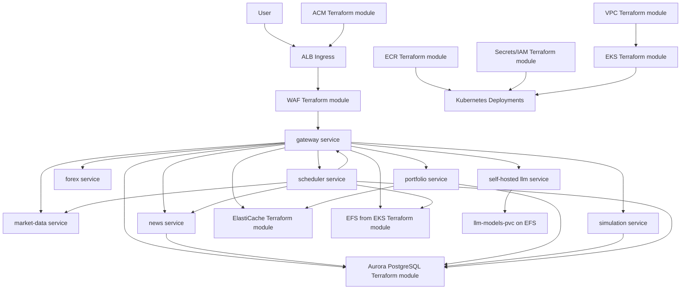

# Investments Assistant K8s

This repository contains the Kubernetes-first version of the Investments
Assistant. It packages the assistant as multiple FastAPI services, deploys them
to EKS, and provisions the AWS infrastructure needed to run them.

The key idea is simple: the gateway owns the user experience and agent loop, and
specialist services own tools. The gateway talks to those services over internal
HTTP tool calls. Terraform provides the AWS pieces; Kubernetes runs the service
pods.

## System Diagram



## Repository Layout

| Path | Purpose |
| --- | --- |
| `terraform/` | AWS infrastructure stack and local modules. Start with `terraform/README.md`. |
| `terraform/modules/*/README.md` | Detailed documentation for each Terraform module. |
| `k8s/` | Kubernetes namespace, config, secrets wiring, service deployments, services, PVC, and ingress. See `k8s/README.md`. |
| `services/` | FastAPI microservices. See `services/README.md` and each service README. |
| `.github/workflows/` | CI workflows for image build/push and EKS deployment. |
| `docker-compose.yml` | Local development topology with app services, PostgreSQL, Redis, and Ollama. |
| `Makefile` | Common local, Kubernetes, Terraform, and ECR commands. |

## How The Pieces Fit

Terraform builds the infrastructure:

- The VPC module creates networking.
- The EKS module creates the cluster, general worker node group, dedicated LLM
  node group, controllers, and EFS storage.
- The ECR module creates one image repository per service.
- The ACM module creates and validates the ALB HTTPS certificate when
  `app_domain_name` and either `app_route53_zone_id` or
  `app_route53_zone_name` are set.
- The RDS and ElastiCache modules provide PostgreSQL and Redis.
- The WAF module protects the public ALB.
- The secrets module creates IAM roles and permissions for Kubernetes service
  accounts and External Secrets.

Kubernetes then deploys the application:

- `gateway` is the only external service, reached through ALB Ingress.
- `market-data`, `forex`, `news`, `portfolio`, `simulation`, and `scheduler`
  are cluster-internal services.
- `investments-config` provides non-secret settings.
- `investments-secrets` is populated from AWS Secrets Manager by External
  Secrets Operator.
- `reports-pvc` is mounted by gateway and scheduler for generated reports.
- `llm-models-pvc` is mounted by the Ollama deployment for local model storage.

The service layer provides agent capabilities:

- `gateway` handles UI/API/WebSocket traffic, self-hosted LLM calls, and tool routing.
- `market-data` provides stocks, crypto, indicators, options, ticker search, and
  earnings tools.
- `forex` provides FX candles, spot rates, and central bank rates.
- `news` provides fresh and stored news search plus ingestion.
- `portfolio` provides broker integrations and trade safety controls.
- `simulation` provides backtesting.
- `scheduler` coordinates recurring ingestion, autonomous scans, and reports.

For implementation details, use the READMEs in `terraform/`, `k8s/`, and
`services/`.

## Local Development

```bash
cp .env.example .env
make dev-up
```

Gateway runs on `http://localhost:8000`. Docker Compose starts PostgreSQL,
Redis, the local Ollama-compatible LLM service, and all seven application services.

Before using chat locally, load a model into Ollama:

```bash
docker compose exec llm ollama pull llama3.1:8b-instruct
```

Useful commands:

```bash
make dev-logs
make dev-down
make lint
```

## Cloud Deployment Flow

1. Fill `terraform/terraform.tfvars` from `terraform/terraform.tfvars.example`.
2. Set `app_domain_name` and either `app_route53_zone_id` or
   `app_route53_zone_name` if you want Terraform to create the ALB HTTPS
   certificate.
3. Run the end-to-end deployment:

```bash
make deploy-e2e
```

`deploy-e2e` runs Terraform, updates kubeconfig, builds and pushes service
images to ECR, renders Kubernetes manifests with Terraform outputs, applies
them, and waits for rollouts. Terraform writes `db_password` from
`terraform.tfvars` into the `investments/prod` Secrets Manager secret as
`POSTGRES_PASSWORD`. Rendered manifests are written to `.rendered/k8s` and are
not committed.

If you already have a certificate outside Terraform, you can override the
Terraform output with `ACM_CERT_ARN=arn:aws:acm:...`.

If no certificate is available, the generated ingress is HTTP-only. Set
`app_domain_name` and a Route 53 zone in Terraform to enable HTTPS.

By default the command does not pull an Ollama model from an external registry.
For non-air-gapped deployments, add `PULL_LLM_MODEL=true` to pull the configured
model into the `llm` pod.

The Makefile assumes AWS region `eu-south-2` by default. Keep Terraform, ECR,
ACM, WAF, Kubernetes manifests, and GitHub Actions aligned to the same region.
Terraform targets EKS Kubernetes `1.33` by default.

The self-hosted LLM deployment is scheduled onto a dedicated EKS node group by
default. Keep `enable_llm_node_group=true` in Terraform unless you resize the
general worker nodes enough to run the Ollama pod.

## Important Notes

- Do not commit `terraform.tfvars`, Terraform state, `.terraform/`, or plan
  files.
- The gateway no longer uses a hosted LLM API. It calls the self-hosted
  OpenAI-compatible endpoint configured by `LLM_BASE_URL`.
- `EXTERNAL_API_ACCESS=false` is the default. With that setting, market data,
  news ingestion, and broker tools return a disabled message instead of calling
  third-party services.
- The application can place trades when configured in `auto` mode. Keep broker
  credentials, symbol allowlists, and trade limits conservative.
- Generated reports are not financial advice.
