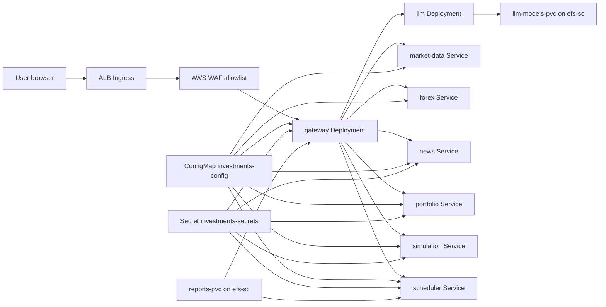

# Kubernetes Manifests

This folder contains the Kubernetes objects that run the investment assistant on
EKS. The manifests are intentionally simple: each service has one Deployment and
one ClusterIP Service, and only the gateway is exposed through an ALB Ingress.

## System Diagram



## Files

| File | Purpose |
| --- | --- |
| `namespace.yaml` | Creates the `investments` namespace. |
| `configmap.yaml` | Non-secret runtime settings and internal service URLs. |
| `serviceaccount.yaml` | `investments-sa` with an IRSA role annotation for AWS access. |
| `external-secrets.yaml` | Pulls `investments/prod` from AWS Secrets Manager into `investments-secrets` using External Secrets `v1` CRDs. |
| `reports-pvc.yaml` | Shared ReadWriteMany PVC backed by the Helm-created EFS StorageClass `efs-sc`. |
| `ingress.yaml` | Internet-facing ALB Ingress that sends all traffic to `gateway:8000`. |
| `llm/*` | Self-hosted Ollama-compatible LLM Deployment, ClusterIP Service, and model PVC. The Deployment targets the OpenTofu-created `workload=llm` node group. |
| `<service>/deployment.yaml` | Service-specific Deployment. |
| `<service>/service.yaml` | Service-specific ClusterIP Service. |
| `gateway/hpa.yaml` | HorizontalPodAutoscaler for the gateway. |

## Services

| Service | Port | Replicas | Exposed Outside Cluster | Notes |
| --- | --- | --- | --- | --- |
| `llm` | `11434` | `1` | No | Self-hosted OpenAI-compatible LLM endpoint for gateway. |
| `gateway` | `8000` | `2` | Yes, through ALB Ingress | UI, REST API, WebSocket chat, and agent router. |
| `market-data` | `8001` | `1` | No | Market, options, technical indicator, and earnings tools. |
| `news` | `8002` | `1` | No | News search, ingestion, and news memory. |
| `portfolio` | `8003` | `1` | No | Broker integrations and trade safety guards. |
| `simulation` | `8004` | `1` | No | Backtesting tools. |
| `scheduler` | `8005` | `1` | No | Scheduled jobs and report generation. |
| `forex` | `8006` | `1` | No | Forex rates, FX candles, and central bank rates. |

## Configuration And Secrets

`configmap.yaml` provides non-secret values such as service URLs, trading mode
defaults, report paths, scheduler intervals, and `POSTGRES_SSL_MODE=require`
for encrypted Aurora PostgreSQL connections. `make k8s-render` replaces the
gateway `ALLOWED_IPS` value and the RDS host, port, database name, and username
from OpenTofu outputs.

`external-secrets.yaml` expects AWS Secrets Manager secret `investments/prod` to
contain sensitive values such as:

- `POSTGRES_PASSWORD`
- `UI_AUTH_USERNAME`
- `UI_AUTH_PASSWORD`

OpenTofu writes `POSTGRES_PASSWORD` from `db_password` in
`terraform/$(TF_ENV).tfvars`.

In production, external browser/API traffic must pass the edge allowlist and the
configured gateway auth mode:

1. AWS WAF allows only the CIDRs from `allowed_ip_cidrs`.
2. With `AUTH_MODE=basic`, gateway Basic Auth validates `UI_AUTH_USERNAME` and
   `UI_AUTH_PASSWORD`.
3. With `AUTH_MODE=cognito`, ALB authenticates users with Cognito and gateway
   maps Cognito groups to `viewer`, `investor`, or `admin`.

Use the public IPv4 that AWS sees from your home VPN egress, for example
`203.0.113.10/32`. Do not use a private LAN or VPN address such as
`192.168.x.x`, `10.x.x.x`, or `172.16.x.x`; AWS WAF cannot see those as the
public client source.

If `EXTERNAL_API_ACCESS=true`, it can also contain optional external integration
credentials through OpenTofu `app_secret_values`, such as:

- `ALPACA_API_KEY` and `ALPACA_SECRET_KEY`
- `BINANCE_API_KEY` and `BINANCE_SECRET_KEY`
- `COINBASE_API_KEY` and `COINBASE_API_SECRET`
- newsletter IMAP credentials

## Required Placeholder Replacements

Before deploying to a real cluster, replace these placeholders:

- `ACCOUNT` in all Deployment image names.
- `REPLACE_WITH_ALLOWED_IPS` in `configmap.yaml`; use the `allowed_ip_cidrs`
  OpenTofu output rendered as a comma-separated list.
- `REPLACE_WITH_AUTH_MODE` in `configmap.yaml`; use `basic` or `cognito` from
  the OpenTofu `auth_mode` output.
- `REPLACE_WITH_AWS_REGION` in `configmap.yaml`; use the deployment AWS region.
- `REPLACE_WITH_COGNITO_USER_POOL_ID` and
  `REPLACE_WITH_COGNITO_APP_CLIENT_ID` in `configmap.yaml`; use OpenTofu
  Cognito outputs when Cognito auth is enabled. They render empty in Basic Auth
  mode.
- `REPLACE_WITH_RDS_ENDPOINT` in `configmap.yaml`; use the `rds_endpoint`
  OpenTofu output.
- `REPLACE_WITH_RDS_PORT` in `configmap.yaml`; use the `rds_port` OpenTofu
  output.
- `REPLACE_WITH_RDS_DATABASE_NAME` in `configmap.yaml`; use the
  `rds_database_name` OpenTofu output.
- `REPLACE_WITH_RDS_MASTER_USERNAME` in `configmap.yaml`; use the
  `rds_master_username` OpenTofu output.
- `REPLACE_WITH_REDIS_ENDPOINT` in `configmap.yaml`; use the `redis_endpoint`
  OpenTofu output when Redis AUTH is disabled. If Redis AUTH is enabled, put a
  full authenticated `REDIS_URL` in OpenTofu `app_secret_values` instead.
- ACM certificate ARN in `ingress.yaml`; use the `acm_certificate_arn`
  OpenTofu output or pass `ACM_CERT_ARN` to the Makefile as an override. If no
  certificate is available, the Makefile renders an HTTP-only ALB ingress.
- Cognito ALB annotations in `ingress.yaml`; `make k8s-render` keeps and fills
  them only when `auth_mode=cognito`.
- WAF WebACL ARN in `ingress.yaml`; use the `waf_webacl_arn` OpenTofu output.
- IRSA role ARN in `serviceaccount.yaml`; use the `irsa_role_arn` OpenTofu output.

The manifests default to `eu-south-2`. Keep the region consistent with
OpenTofu, ECR, ACM, WAF, and GitHub Actions.

## Public Access URL

The deployed UI is not served from `localhost`. It is exposed through the AWS
Load Balancer Controller Ingress. If you do not configure `app_domain_name` and
ACM, the ingress is rendered HTTP-only and you use the AWS-managed ALB hostname:

```bash
make alb-url
```

That prints a URL like `http://<alb-name>.<region>.elb.amazonaws.com`. No
Route 53 record is required for that built-in hostname.

HTTP Basic Auth over the built-in ALB hostname is still plain HTTP. The WAF
allowlist limits who can reach it, but the credentials are not encrypted in
transit. For encrypted browser authentication, configure a domain with
`app_domain_name` plus a Route 53 zone so OpenTofu can issue an ACM certificate,
then run `make route53-alias` after the Ingress exists and browse through that
custom HTTPS domain. The raw `*.elb.amazonaws.com` hostname cannot use your ACM
certificate.

Cognito/ALB authentication also requires the custom HTTPS path. When
`enable_cognito_auth=true`, `make k8s-render` renders the ALB Cognito
annotations and sets `AUTH_MODE=cognito`. Users must be assigned to one of these
Cognito user-pool groups:

- `viewer`: chat and news tools only.
- `investor`: market data, forex, news, simulations, and reports; no portfolio.
- `admin`: all gateway capabilities.

## Cluster Add-ons

Before applying these manifests, install the shared cluster add-ons from the
separate `Investments-Assistant/helm-charts` repository:

```bash
make helm-apply
```

That target installs or upgrades AWS EFS CSI driver, AWS Load Balancer
Controller, and External Secrets Operator with values from OpenTofu outputs.

## Apply Order

`make k8s-apply` applies manifests in dependency order:

1. Helm add-ons.
2. Namespace.
3. ConfigMap.
4. ServiceAccount.
5. Reports PVC and LLM model PVC.
6. Wait for PVCs to bind.
7. Wait for External Secrets CRDs.
8. ExternalSecret.
9. Service deployments and ClusterIP Services.
10. Ingress.

This order matters because pods reference `investments-sa` and
`investments-secrets`, the gateway and scheduler mount `reports-pvc`, and the
LLM pod mounts `llm-models-pvc`.

## Local LLM Model

The `llm` manifest runs Ollama and exposes an OpenAI-compatible endpoint at
`http://llm:11434/v1`. Load the configured model into the `llm-models-pvc`
before using the gateway chat. One practical path is to exec into the pod and
run:

```bash
ollama pull llama3.1:8b-instruct
```

For stricter no-egress deployments, prebuild an internal Ollama image or preload
the PVC from an internal artifact source instead of pulling from the public
Ollama registry at runtime.

The LLM pod has `nodeSelector: workload=llm` and tolerates the matching
`NoSchedule` taint from the OpenTofu EKS module. Keep
`enable_llm_node_group=true` or remove those scheduling rules if you want to run
Ollama on the general worker nodes.
