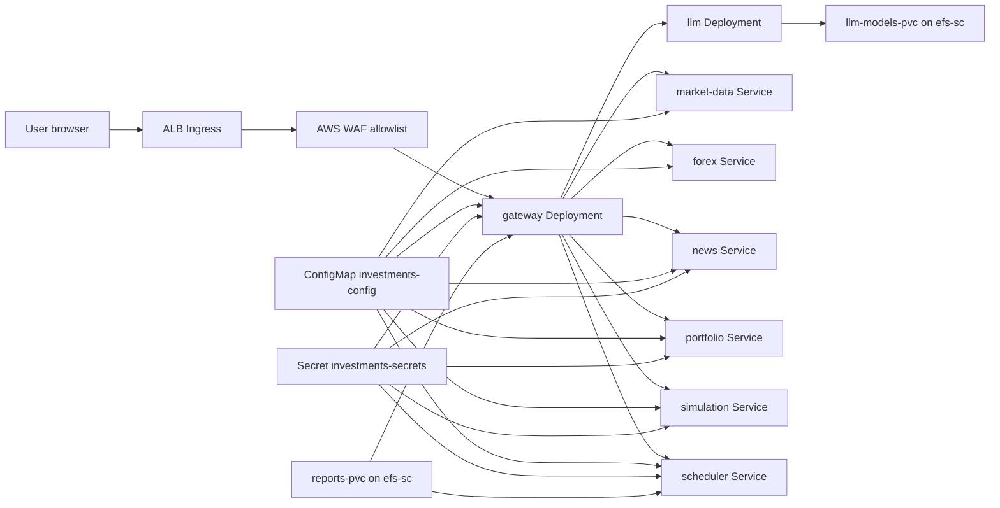

# Kubernetes Manifests

This folder contains the Kubernetes objects that run the investment assistant on
EKS. The manifests are intentionally simple: each service has one Deployment and
one ClusterIP Service, and only the gateway is exposed through an ALB Ingress.

## System Diagram



## Files

| File | Purpose |
| --- | --- |
| `namespace.yaml` | Creates the `investments` namespace. |
| `configmap.yaml` | Non-secret runtime settings and internal service URLs. |
| `serviceaccount.yaml` | `investments-sa` with an IRSA role annotation for AWS access. |
| `external-secrets.yaml` | Pulls `investments/prod` from AWS Secrets Manager into `investments-secrets` using External Secrets `v1` CRDs. |
| `reports-pvc.yaml` | Shared ReadWriteMany PVC backed by the Terraform-created EFS StorageClass `efs-sc`. |
| `ingress.yaml` | Internet-facing ALB Ingress that sends all traffic to `gateway:8000`. |
| `llm/*` | Self-hosted Ollama-compatible LLM Deployment, ClusterIP Service, and model PVC. The Deployment targets the Terraform-created `workload=llm` node group. |
| `<service>/deployment.yaml` | Service-specific Deployment. |
| `<service>/service.yaml` | Service-specific ClusterIP Service. |
| `gateway/hpa.yaml` | HorizontalPodAutoscaler for the gateway. |

## Services

| Service | Port | Replicas | Exposed Outside Cluster | Notes |
| --- | --- | --- | --- | --- |
| `llm` | `11434` | `1` | No | Self-hosted OpenAI-compatible LLM endpoint for gateway. |
| `gateway` | `8000` | `2` | Yes, through ALB Ingress | UI, REST API, WebSocket chat, and agent router. |
| `market-data` | `8001` | `1` | No | Market, options, technical indicator, and earnings tools. |
| `news` | `8002` | `1` | No | News search, ingestion, and news memory. |
| `portfolio` | `8003` | `1` | No | Broker integrations and trade safety guards. |
| `simulation` | `8004` | `1` | No | Backtesting tools. |
| `scheduler` | `8005` | `1` | No | Scheduled jobs and report generation. |
| `forex` | `8006` | `1` | No | Forex rates, FX candles, and central bank rates. |

## Configuration And Secrets

`configmap.yaml` provides non-secret values such as service URLs, trading mode
defaults, report paths, scheduler intervals, and `POSTGRES_SSL_MODE=require`
for encrypted Aurora PostgreSQL connections. `make k8s-render` replaces the
RDS host, port, database name, and username from Terraform outputs.

`external-secrets.yaml` expects AWS Secrets Manager secret `investments/prod` to
contain sensitive values such as:

- `POSTGRES_PASSWORD`

Terraform writes `POSTGRES_PASSWORD` from `db_password` in
`terraform/terraform.tfvars`.

If `EXTERNAL_API_ACCESS=true`, it can also contain optional external integration
credentials through Terraform `app_secret_values`, such as:

- `ALPACA_API_KEY` and `ALPACA_SECRET_KEY`
- `BINANCE_API_KEY` and `BINANCE_SECRET_KEY`
- `COINBASE_API_KEY` and `COINBASE_API_SECRET`
- newsletter IMAP credentials

## Required Placeholder Replacements

Before deploying to a real cluster, replace these placeholders:

- `ACCOUNT` in all Deployment image names.
- `REPLACE_WITH_RDS_ENDPOINT` in `configmap.yaml`; use the `rds_endpoint`
  Terraform output.
- `REPLACE_WITH_RDS_PORT` in `configmap.yaml`; use the `rds_port` Terraform
  output.
- `REPLACE_WITH_RDS_DATABASE_NAME` in `configmap.yaml`; use the
  `rds_database_name` Terraform output.
- `REPLACE_WITH_RDS_MASTER_USERNAME` in `configmap.yaml`; use the
  `rds_master_username` Terraform output.
- `REPLACE_WITH_REDIS_ENDPOINT` in `configmap.yaml`; use the `redis_endpoint`
  Terraform output when Redis AUTH is disabled. If Redis AUTH is enabled, put a
  full authenticated `REDIS_URL` in Terraform `app_secret_values` instead.
- ACM certificate ARN in `ingress.yaml`; use the `acm_certificate_arn`
  Terraform output or pass `ACM_CERT_ARN` to the Makefile as an override. If no
  certificate is available, the Makefile renders an HTTP-only ALB ingress.
- WAF WebACL ARN in `ingress.yaml`; use the `waf_webacl_arn` Terraform output.
- IRSA role ARN in `serviceaccount.yaml`; use the `irsa_role_arn` Terraform output.

The manifests default to `eu-south-2`. Keep the region consistent with
Terraform, ECR, ACM, WAF, and GitHub Actions.

## Apply Order

`make k8s-apply` applies manifests in dependency order:

1. Namespace.
2. ConfigMap.
3. ServiceAccount.
4. Reports PVC and LLM model PVC.
5. Wait for PVCs to bind.
6. Wait for External Secrets CRDs.
7. ExternalSecret.
8. Service deployments and ClusterIP Services.
9. Ingress.

This order matters because pods reference `investments-sa` and
`investments-secrets`, the gateway and scheduler mount `reports-pvc`, and the
LLM pod mounts `llm-models-pvc`.

## Local LLM Model

The `llm` manifest runs Ollama and exposes an OpenAI-compatible endpoint at
`http://llm:11434/v1`. Load the configured model into the `llm-models-pvc`
before using the gateway chat. One practical path is to exec into the pod and
run:

```bash
ollama pull llama3.1:8b-instruct
```

For stricter no-egress deployments, prebuild an internal Ollama image or preload
the PVC from an internal artifact source instead of pulling from the public
Ollama registry at runtime.

The LLM pod has `nodeSelector: workload=llm` and tolerates the matching
`NoSchedule` taint from the Terraform EKS module. Keep
`enable_llm_node_group=true` or remove those scheduling rules if you want to run
Ollama on the general worker nodes.
