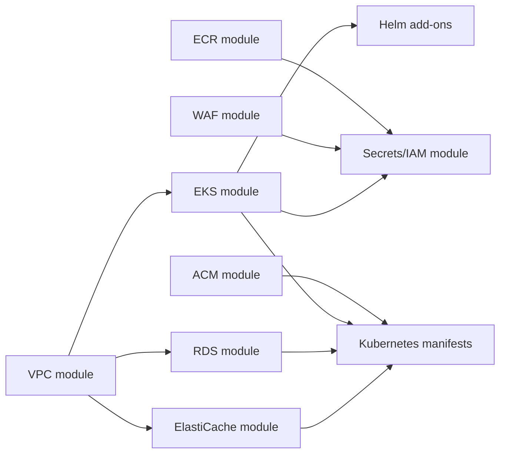

# OpenTofu

This folder provisions the AWS infrastructure used by the Kubernetes deployment.
It composes shared modules from the `Investments-Assistant/opentofu-modules`
repository and stores remote state in the S3 backend configured in `backend.tf`.

## Stack Overview



## What It Creates

- A VPC with public and private subnets, an internet gateway, and a NAT gateway.
- An EKS cluster, general managed node group, dedicated LLM managed node group,
  AWS-managed core add-ons, EFS support, and IAM roles for Helm-managed cluster
  add-ons.
- Aurora PostgreSQL Serverless v2 for service-owned tables.
- ElastiCache Redis for shared runtime state such as trading mode.
- One ECR repository per service image.
- An optional DNS-validated ACM certificate for the public ALB.
- An optional AWS-managed CloudFront HTTPS endpoint for deployments without a
  custom domain.
- Optional Cognito user-pool authentication with `viewer`, `investor`, and
  `admin` groups for gateway authorization.
- An EKS access entry for the GitHub Actions deploy role created by
  `core-infra`.
- An AWS WAF WebACL that protects the public ALB with an IP allowlist.
- IAM roles and policies for Kubernetes service accounts and External Secrets.
- An AWS Secrets Manager secret named `investments/prod`; OpenTofu writes
  `POSTGRES_PASSWORD` from `db_password` and any entries from
  `app_secret_values`.

## Main Inputs

Inputs are declared in `variables.tf`. Required values are `allowed_ip_cidrs` and
`db_password`; `app_secret_values`, `redis_auth_token`, `redis_node_type`,
`aurora_postgresql_engine_version`, and LLM node group sizing settings are
optional. Set `app_domain_name` and `app_route53_zone_id` or
`app_route53_zone_name` when you want OpenTofu to create the ALB HTTPS
certificate. Set `enable_cognito_auth=true` when you want ALB/Cognito login and
group-based gateway permissions; this requires the HTTPS domain path. The Aurora
engine version defaults to AWS regional selection to
avoid pinning a version that is not available in the selected region. See
`env.tfvars.example` for the expected shape.

`allowed_ip_cidrs` should contain the public IPv4 CIDR that AWS sees from your
home VPN egress, usually `x.x.x.x/32`. The private VPN/LAN address is not useful
for the public ALB allowlist.

`enable_github_actions_deploy_access=true` creates EKS access for
`investments-assistant-github-actions-deploy-role` by default. Override
`github_actions_deploy_role_arn` only if core-infra creates the role under a
different name or account.

## Main Outputs

Outputs in `outputs.tf` expose the EKS endpoint/name/CA data, ECR repository
URLs, RDS endpoint, RDS port, RDS database name, RDS master username, Redis
endpoint, WAF WebACL ARN, application IRSA role ARN, EFS ID, VPC ID, and the
IRSA role ARNs used by Helm-managed add-ons. When enabled, the ACM certificate
ARN and Cognito user-pool outputs are also exposed for the ALB Ingress and
gateway ConfigMap. The Makefile renders these values into Kubernetes manifests
and Helm values before deploying workloads.

## File Layout

The stack is split by ownership instead of keeping every resource in
`main.tf`:

- `data.tf`: AWS account and availability-zone data sources.
- `locals.tf`: derived values such as AZ selection and Cognito callback URLs.
- `networking.tf`: VPC module.
- `compute.tf`: EKS module.
- `data_services.tf`: Aurora PostgreSQL and ElastiCache modules.
- `registry.tf`: ECR repositories.
- `edge.tf`: WAF, ACM, and Cognito edge/auth resources.
- `secrets.tf`: Secrets Manager secret and IRSA/secrets module.
- `access.tf`: EKS access entry for the GitHub Actions deploy role.

## Modules

The stack consumes these module directories from `opentofu-modules` using Git
SSH sources such as
`git::ssh://git@github.com/Investments-Assistant/opentofu-modules.git//ecr?ref=v0.0.1`:

- `vpc`: network foundation.
- `eks`: Kubernetes cluster, worker node groups, EFS, and IAM roles for
  Helm-managed add-ons.
- `rds`: Aurora PostgreSQL.
- `elasticache`: Redis.
- `ecr`: service image repositories.
- `acm`: ALB HTTPS certificate and DNS validation.
- `cloudfront_https`: AWS-managed `*.cloudfront.net` HTTPS endpoint.
- `cognito`: user pool, ALB app client, hosted UI domain, and role groups.
- `waf`: ALB-facing WAF allowlist.
- `secrets`: IAM roles, AWS Secrets Manager permissions, and ALB log bucket.

The source references are pinned to the `opentofu-modules` `v0.0.1` release.
After publishing a new module release, update the module refs before running
`make tf-apply`; `make helm-apply` uses the EKS module outputs for the
EFS CSI and AWS Load Balancer Controller role ARNs when available, and falls
back to the module's conventional role names during module updates.

## Basic Usage

```bash
cp env.tfvars.example prod.tfvars
cd ..
make tf-apply TF_ENV=prod
```

Do not commit `*.tfvars`, `ttplan`, `ttplan.json`, `ttoutputs.json`,
`.terraform/`, or state files.

`app_secret_values` can be used for UI Basic Auth and optional secret settings
such as broker or newsletter credentials:

```hcl
app_secret_values = {
  UI_AUTH_USERNAME = "investments"
  UI_AUTH_PASSWORD = "CHANGE_ME_STRONG_UI_PASSWORD"
}
```

Do not include `POSTGRES_PASSWORD` there; it is derived from `db_password`.

## HTTPS DNS Flow

ACM cannot issue a certificate for the AWS-owned ALB hostname. To use
custom-domain HTTPS, configure a domain that you control:

```hcl
app_domain_name       = "assistant.example.com"
app_route53_zone_name = "example.com."
```

OpenTofu creates and validates the ACM certificate. After Kubernetes creates the
ALB, run:

```bash
make route53-alias
```

That target points `app_domain_name` at the ALB with a Route 53 ALIAS record.
Use `https://assistant.example.com`, not the raw `*.elb.amazonaws.com` hostname.

If you do not own a domain, run `make deploy-e2e` or `make cloudfront-apply`.
The Makefile writes the live ALB hostname to `opentofu/cloudfront.auto.tfvars`
and OpenTofu creates a CloudFront distribution using the default AWS-managed
`*.cloudfront.net` certificate. Use `make cloudfront-url` to print the HTTPS
URL.

## Cognito Role Groups

Use Cognito user-pool groups for application users, not IAM groups. IAM groups
grant AWS API permissions to AWS principals; the gateway needs authenticated
application-user claims. Cognito emits group membership in the token, and the
gateway maps those groups to runtime permissions:

- `viewer`: chat plus news tools.
- `investor`: market data, forex, news, simulations, and reports, but no
  portfolio or trading tools.
- `admin`: all services and administrative controls.

After `tofu apply`, create Cognito users and assign them to groups:

```bash
aws cognito-idp admin-create-user \
  --user-pool-id "$(tofu output -raw cognito_user_pool_id)" \
  --username user@example.com \
  --user-attributes Name=email,Value=user@example.com Name=email_verified,Value=true

aws cognito-idp admin-add-user-to-group \
  --user-pool-id "$(tofu output -raw cognito_user_pool_id)" \
  --username user@example.com \
  --group-name viewer
```

## Kubernetes Version

The stack targets EKS Kubernetes `1.33` by default. AWS supports EKS `1.33`, but
existing EKS clusters can only be upgraded one minor version at a time. If your
live cluster is still `1.30`, upgrade through `1.31`, then `1.32`, then `1.33`
or create a replacement `1.33` cluster and move workloads across.
