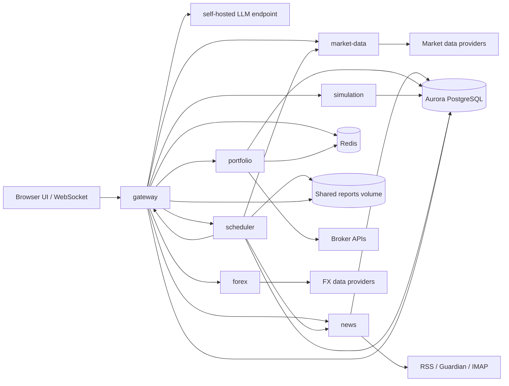

# Services

The application is split into small FastAPI services. The gateway owns the user
interface and local LLM conversation loop, while specialist services own tool
execution. The current service-to-service protocol is HTTP: the gateway sends
tool calls to each service's `/tools/invoke` endpoint.

## System Diagram



## Shared Conventions

- Runtime: Python 3.11.
- Framework: FastAPI.
- Container entrypoint: `uvicorn src.app:app`.
- Health endpoint: `/health` for internal services, `/api/health` for the
  gateway.
- Tool endpoint: `/tools/invoke` with JSON body
  `{"tool_name": "...", "tool_input": {...}}`.
- Service discovery: Kubernetes DNS names from `k8s/configmap.yaml`.
- Secrets: environment variables loaded from `investments-secrets`.
- Persistence: each service creates only its own SQLAlchemy tables on startup.
- External market/news/broker integrations are disabled by default with
  `EXTERNAL_API_ACCESS=false`.

## Service Catalog

| Service | Port | README | Main Responsibility |
| --- | --- | --- | --- |
| `gateway` | `8000` | `gateway/README.md` | UI, WebSocket chat, local LLM client, tool routing, IP allowlist. |
| `market-data` | `8001` | `market-data/README.md` | Quotes, crypto, market overview, indicators, options, ticker search, earnings when external access is enabled. |
| `news` | `8002` | `news/README.md` | Stored news search by default; live RSS/API/newsletter ingestion when external access is enabled. |
| `portfolio` | `8003` | `portfolio/README.md` | Local trade history by default; broker account data and trading when external access is enabled. |
| `simulation` | `8004` | `simulation/README.md` | Strategy backtests and simulation persistence. |
| `scheduler` | `8005` | `scheduler/README.md` | Recurring ingestion, market refresh, autonomous scans, report generation. |
| `forex` | `8006` | `forex/README.md` | Forex candles, spot rates, and central bank rates. |

## Local Development

From the repository root:

```bash
cp .env.example .env
make dev-up
```

That starts PostgreSQL, Redis, the Ollama-compatible local LLM service, and all
application services using `docker-compose.yml`. Gateway is available on
`http://localhost:8000`.

Pull the configured model before using chat:

```bash
docker compose exec llm ollama pull llama3.1:8b
```

To work on one service directly:

```bash
cd services/<service>
python -m pip install -e .
python -m uvicorn src.app:app --host 0.0.0.0 --port <port>
```

Set `ENVIRONMENT=development` to expose FastAPI docs for a service.
