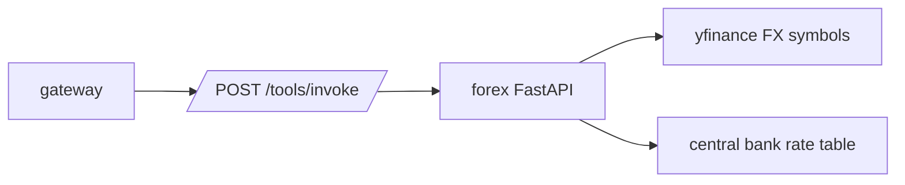

# Forex Service

Forex provides FX candles, spot rates, and central bank rate reference data. It
is an internal service called by the gateway.

## System Diagram



## Responsibilities

- Normalize user pair formats such as `EUR/USD`, `EURUSD`, and Yahoo Finance FX
  symbols.
- Fetch OHLCV candle data for FX pairs.
- Return spot rates for common currency pairs.
- Return central bank rates for selected currencies.

## Endpoints

| Method | Path | Purpose |
| --- | --- | --- |
| `GET` | `/health` | Health check. |
| `POST` | `/tools/invoke` | Tool dispatch from gateway. |

## Tools

| Tool | Purpose |
| --- | --- |
| `get_forex_data` | Historical candle data for a currency pair. |
| `get_forex_rates` | Latest spot rates for requested or default pairs. |
| `get_central_bank_rates` | Central bank policy rates for requested or default currencies. |

## Configuration

| Variable | Purpose |
| --- | --- |
| `EXTERNAL_API_ACCESS` | Must be `true` for this service to call external FX data providers. Defaults to `false`. |
| `ENVIRONMENT` | Set to `development` to expose FastAPI docs. |
| `LOG_LEVEL` | Python logging level. |

## Persistence

This service does not own database tables. Results are returned directly to the
gateway.

## Run Locally

```bash
python -m pip install -e .
ENVIRONMENT=development python -m uvicorn src.app:app --host 0.0.0.0 --port 8006
```
