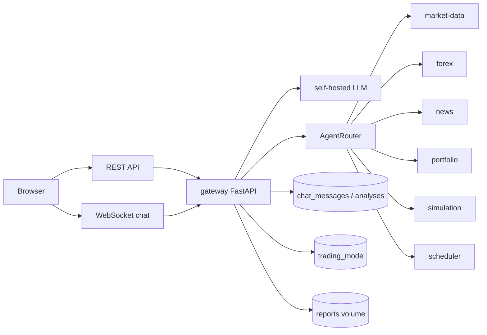

# Gateway Service

Gateway is the only externally user-facing service. It serves the main chat UI,
dashboard workspaces, REST APIs, and WebSocket chat. It talks to a self-hosted
OpenAI-compatible LLM and routes tool calls to the internal services.

## System Diagram



## Responsibilities

- Serve `/` and static frontend assets.
- Accept WebSocket chat on `/ws/chat/{session_id}`.
- Persist chat history in PostgreSQL and reload it when the browser returns with
  the same session id.
- Stream local LLM responses and handle tool use.
- Route tool calls to the owning service over HTTP.
- Maintain runtime trading mode in Redis.
- Proxy portfolio dashboard, report, and trade list APIs for the UI.
- Enforce IP allowlisting in production.

## Endpoints

| Method | Path | Purpose |
| --- | --- | --- |
| `GET` | `/` | Main UI with chat and service dashboard workspaces. |
| `GET` | `/api/health` | Gateway health and configured service URLs. |
| `GET` | `/api/market/snapshot` | Calls `get_market_overview` through the router. |
| `GET` | `/api/chat/{session_id}/messages` | Persisted chat history for the browser session. |
| `GET` | `/api/portfolio/dashboard` | Portfolio summary plus recent trades for the dashboard. |
| `GET` | `/api/reports` | Proxies report list from scheduler. |
| `GET` | `/api/trades` | Proxies trade list from portfolio. |
| `POST` | `/api/autonomous-scan` | Runs an autonomous scan or supplied report prompt. |
| `WS` | `/ws/chat/{session_id}` | Interactive agent chat. |

## Routed Tools

Gateway routes tools to these services:

- market-data: `get_stock_data`, `get_crypto_data`, `get_market_overview`,
  `get_technical_indicators`, `get_options_chain`, `search_ticker`,
  `get_earnings_calendar`.
- forex: `get_forex_data`, `get_forex_rates`, `get_central_bank_rates`.
- news: `search_market_news`, `search_stored_news`, `get_latest_news`.
- portfolio: `get_portfolio_summary`, `get_account_info`, `get_trade_history`,
  `execute_trade`, `confirm_trade`, `cancel_order`.
- simulation: `run_simulation`.
- scheduler: `generate_report`.
- local gateway tool: `set_trading_mode`.

## Configuration

Important environment variables:

| Variable | Purpose |
| --- | --- |
| `LLM_BASE_URL` | Self-hosted OpenAI-compatible endpoint, for example `http://llm:11434/v1`. |
| `LLM_API_KEY` | Optional key if the self-hosted gateway requires one. Blank by default. |
| `LLM_MODEL_NAME` | Local model name. |
| `ALLOWED_IPS` | Comma-separated CIDRs allowed to use UI/API in production. |
| `POSTGRES_*` | PostgreSQL connection settings. |
| `REDIS_URL` | Redis URL for shared trading mode. |
| `MARKET_DATA_URL`, `FOREX_URL`, `NEWS_URL`, `PORTFOLIO_URL`, `SIMULATION_URL`, `SCHEDULER_URL` | Internal service URLs. |
| `REPORTS_DIR` | Mounted directory for generated reports. |

## Persistence

Gateway owns two database tables:

- `chat_messages`: user and assistant messages by session.
- `analyses`: structured analysis records.

The browser stores a UUID session id in `localStorage`. Returning to `/` from the
same browser reloads the matching rows from `chat_messages`; a different browser
or cleared local storage starts a new chat session.

## Run Locally

```bash
python -m pip install -e .
ENVIRONMENT=development python -m uvicorn src.app:app --host 0.0.0.0 --port 8000
```

The configured LLM endpoint must be reachable before chat requests can complete.
