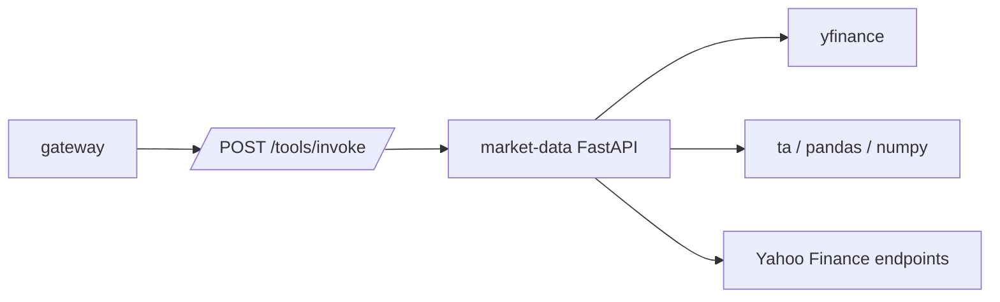

# Market Data Service

Market Data provides price, indicator, options, ticker search, and earnings
tools. It is an internal service called by the gateway.

## System Diagram



## Responsibilities

- Fetch historical stock and crypto data.
- Produce a small market overview snapshot.
- Calculate technical indicators.
- Fetch options chains.
- Search ticker symbols.
- Fetch an upcoming earnings calendar.

## Endpoints

| Method | Path | Purpose |
| --- | --- | --- |
| `GET` | `/health` | Health check. |
| `POST` | `/tools/invoke` | Tool dispatch from gateway. |

## Tools

| Tool | Purpose |
| --- | --- |
| `get_stock_data` | Historical OHLCV records for a stock symbol. |
| `get_crypto_data` | Historical OHLCV records for a crypto symbol. |
| `get_market_overview` | Snapshot for major indexes, rates, crypto, and volatility symbols. |
| `get_technical_indicators` | RSI, moving averages, MACD, Bollinger bands, volatility, and signal summary. |
| `get_options_chain` | Calls and puts for one or more expiries. |
| `search_ticker` | Ticker lookup by query. |
| `get_earnings_calendar` | Upcoming earnings rows. |

## Configuration

| Variable | Purpose |
| --- | --- |
| `EXTERNAL_API_ACCESS` | Must be `true` for this service to call external market data providers. Defaults to `false`. |
| `ENVIRONMENT` | Set to `development` to expose FastAPI docs. |
| `LOG_LEVEL` | Python logging level. |
| `NEWSAPI_KEY`, `GUARDIAN_API_KEY` | Present in settings for compatibility, but market-data tools primarily use market data providers. |

## Persistence

This service does not own database tables. Results are returned directly to the
gateway.

## Run Locally

```bash
python -m pip install -e .
ENVIRONMENT=development python -m uvicorn src.app:app --host 0.0.0.0 --port 8001
```
