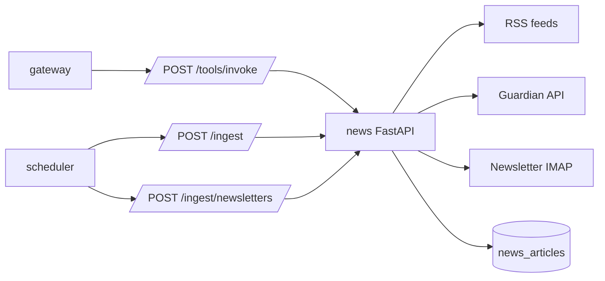

# News Service

News owns market-news lookup, ingestion, newsletter ingestion, sentiment tagging,
and stored news search.

## System Diagram



## Responsibilities

- Fetch current news for an on-demand query.
- Ingest configured RSS feeds and Guardian API results.
- Ingest newsletters through IMAP.
- Score sentiment and extract tags.
- Persist deduplicated articles.
- Search stored news memory by query, source, sentiment, and recency.

## Endpoints

| Method | Path | Purpose |
| --- | --- | --- |
| `GET` | `/health` | Health check. |
| `POST` | `/tools/invoke` | Tool dispatch from gateway. |
| `POST` | `/ingest` | Manual or scheduled news ingestion. |
| `POST` | `/ingest/newsletters` | Manual or scheduled newsletter ingestion. |

## Tools

| Tool | Purpose |
| --- | --- |
| `search_market_news` | Fetch recent market news for a query and analyze sentiment. |
| `search_stored_news` | Search persisted news articles. |
| `get_latest_news` | Return most recently ingested articles. |

## Configuration

| Variable | Purpose |
| --- | --- |
| `EXTERNAL_API_ACCESS` | Must be `true` for live news, Guardian, RSS, and IMAP ingestion. Stored-news reads still work when false. |
| `NEWSAPI_KEY` | Optional news provider key used by query tools. |
| `GUARDIAN_API_KEY` | Guardian API key for ingestion. |
| `NEWSLETTER_IMAP_SERVER`, `NEWSLETTER_IMAP_PORT` | IMAP server settings. |
| `NEWSLETTER_EMAIL_USER`, `NEWSLETTER_EMAIL_PASSWORD` | IMAP credentials. |
| `NEWSLETTER_SENDER_FILTER` | Optional sender filter for newsletter ingestion. |
| `POSTGRES_*` | PostgreSQL connection settings. |
| `ENVIRONMENT`, `LOG_LEVEL` | Runtime environment and logging. |

## Persistence

News owns the `news_articles` table with article title, summary, content, source,
URL, published/fetched timestamps, sentiment, score, and tags.

## Run Locally

```bash
python -m pip install -e .
ENVIRONMENT=development python -m uvicorn src.app:app --host 0.0.0.0 --port 8002
```
