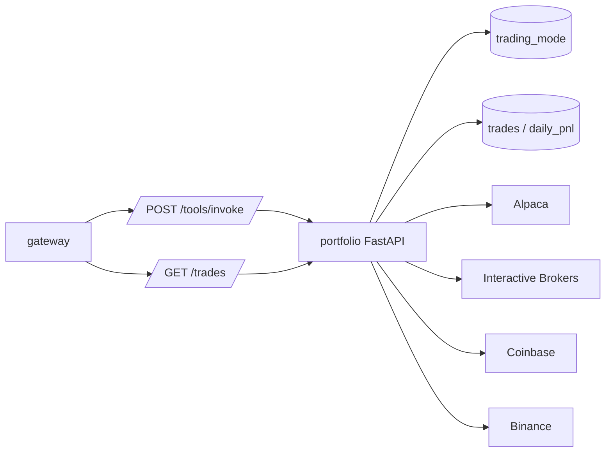

# Portfolio Service

Portfolio owns broker account reads, trade execution, confirmation flow, trade
history, and trading safety checks.

## System Diagram



## Responsibilities

- Read account balances and positions from configured brokers.
- Provide recent trade history.
- Enforce trading mode:
  - `recommend`: returns a recommendation that requires user confirmation.
  - `auto`: submits an order directly within configured limits.
- Enforce maximum trade size and daily loss limits.
- Persist trade records and daily PnL state.
- Cancel open orders through the selected broker.

## Endpoints

| Method | Path | Purpose |
| --- | --- | --- |
| `GET` | `/health` | Health check. |
| `POST` | `/tools/invoke` | Tool dispatch from gateway. |
| `GET` | `/trades` | Direct trade listing used by gateway `/api/trades`. |

## Tools

| Tool | Purpose |
| --- | --- |
| `get_portfolio_summary` | Positions and portfolio data across one or all brokers. |
| `get_account_info` | Account cash, buying power, and balances for one broker. |
| `get_trade_history` | Persisted trade history by broker. |
| `execute_trade` | Recommend or execute a trade depending on trading mode. |
| `confirm_trade` | Execute a trade that was previously recommended. |
| `cancel_order` | Cancel an order with a broker. |

## Configuration

| Variable | Purpose |
| --- | --- |
| `EXTERNAL_API_ACCESS` | Must be `true` for broker account calls, trade execution, and cancellation. Local trade history still works when false. |
| `TRADING_MODE` | Default mode, `recommend` or `auto`. Redis can override it at runtime. |
| `AUTO_MAX_TRADE_USD` | Maximum notional value for autonomous trades. |
| `AUTO_DAILY_LOSS_LIMIT_USD` | Daily realized loss threshold that halts auto trading. |
| `AUTO_ALLOWED_SYMBOLS` | Optional comma-separated symbol allowlist for auto trading. |
| `REDIS_URL` | Shared trading mode state. |
| `POSTGRES_*` | PostgreSQL connection settings. |
| `ALPACA_API_KEY`, `ALPACA_SECRET_KEY`, `ALPACA_PAPER` | Alpaca configuration. |
| `IBKR_HOST`, `IBKR_PORT`, `IBKR_CLIENT_ID`, `IBKR_ENABLED` | Interactive Brokers configuration. |
| `COINBASE_API_KEY`, `COINBASE_API_SECRET` | Coinbase configuration. |
| `BINANCE_API_KEY`, `BINANCE_SECRET_KEY`, `BINANCE_TESTNET` | Binance configuration. |

## Persistence

Portfolio owns two tables:

- `trades`: broker, symbol, side, quantity, price, order type, status, mode,
  reason, broker order ID, PnL, and timestamps.
- `daily_pnl`: daily realized/unrealized PnL and auto-trading halt state.

## Run Locally

```bash
python -m pip install -e .
ENVIRONMENT=development python -m uvicorn src.app:app --host 0.0.0.0 --port 8003
```
