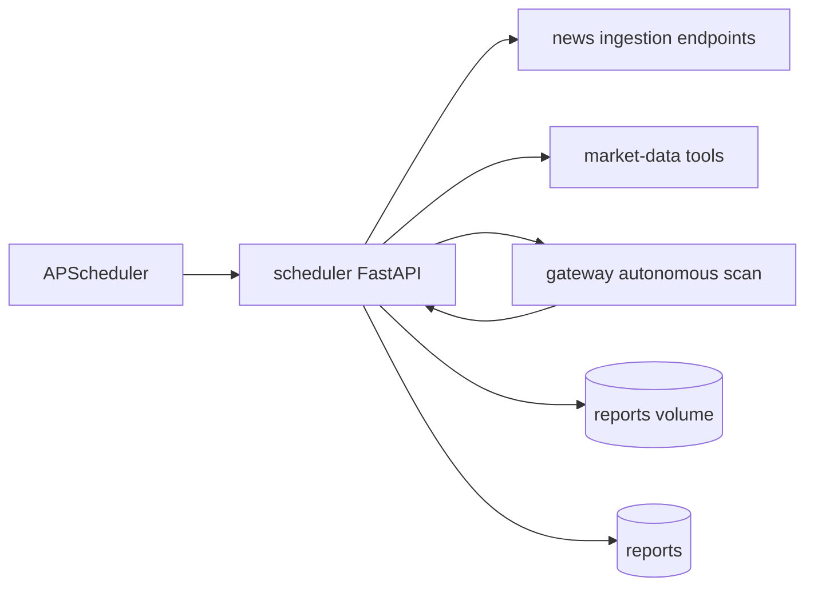

# Scheduler Service

Scheduler owns recurring jobs and generated investment reports.

## System Diagram



## Responsibilities

- Run periodic market refreshes.
- Trigger news ingestion every 30 minutes.
- Trigger newsletter ingestion weekly.
- Trigger autonomous market scans during weekday market hours.
- Generate weekly and on-demand reports.
- Persist report metadata and expose report listings.

## Scheduled Jobs

| Job ID | Schedule | Purpose |
| --- | --- | --- |
| `market_refresh` | Interval from `MARKET_DATA_REFRESH_MINUTES` | Calls market-data overview tool. |
| `weekly_report` | Day/hour/minute from `WEEKLY_REPORT_*` | Generates a report for the last 7 days. |
| `autonomous_scan` | Weekdays, 14:00-21:00 UTC every 30 minutes | Calls gateway autonomous scan. |
| `news_ingestion` | Every 30 minutes | Calls news `/ingest`. |
| `newsletter_ingestion` | Saturdays 09:00 UTC | Calls news `/ingest/newsletters`. |

## Endpoints

| Method | Path | Purpose |
| --- | --- | --- |
| `GET` | `/health` | Health check and scheduled job next-run data. |
| `GET` | `/reports` | List persisted reports. |
| `POST` | `/reports/generate` | Generate a report for a requested period. |
| `POST` | `/tools/invoke` | Accepts gateway `generate_report` tool calls. |

## Tools

| Tool | Purpose |
| --- | --- |
| `generate_report` | Generate a report for `period_start` and optional `period_end`. |

## Configuration

| Variable | Purpose |
| --- | --- |
| `POSTGRES_*` | PostgreSQL connection settings. |
| `REPORTS_DIR` | Directory where report PDFs are written. |
| `MARKET_DATA_REFRESH_MINUTES` | Market refresh interval. |
| `WEEKLY_REPORT_DAY` | Weekly report weekday, `0` Monday through `6` Sunday. |
| `WEEKLY_REPORT_HOUR`, `WEEKLY_REPORT_MINUTE` | Weekly report time. |
| `GATEWAY_URL`, `NEWS_URL`, `MARKET_DATA_URL` | Internal service URLs. |
| `ENVIRONMENT`, `LOG_LEVEL` | Runtime environment and logging. |

## Persistence

Scheduler owns the `reports` table with title, period, HTML content, optional PDF
path, total PnL, and creation timestamp. In Kubernetes, generated PDFs are
stored on the shared `reports-pvc` volume so gateway can surface them.

## Run Locally

```bash
python -m pip install -e .
ENVIRONMENT=development python -m uvicorn src.app:app --host 0.0.0.0 --port 8005
```
