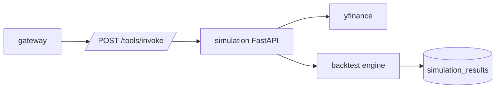

# Simulation Service

Simulation runs strategy backtests against historical price data and persists
successful results.

## System Diagram



## Responsibilities

- Download historical price data.
- Run supported strategy simulations.
- Calculate performance metrics.
- Persist successful simulation results.

## Endpoints

| Method | Path | Purpose |
| --- | --- | --- |
| `GET` | `/health` | Health check. |
| `POST` | `/tools/invoke` | Tool dispatch from gateway. |

## Tools

| Tool | Purpose |
| --- | --- |
| `run_simulation` | Run a backtest for requested symbols, period, capital, and strategy. |

## Supported Strategies

| Strategy | Parameters |
| --- | --- |
| `buy_and_hold` | None. |
| `sma_crossover` | `fast`, `slow`. |
| `rsi_mean_reversion` | `rsi_buy`, `rsi_sell`. |
| `momentum` | `lookback_days`, `rebalance_days`, `min_return`. |

## Configuration

| Variable | Purpose |
| --- | --- |
| `POSTGRES_*` | PostgreSQL connection settings. |
| `ENVIRONMENT`, `LOG_LEVEL` | Runtime environment and logging. |

## Persistence

Simulation owns the `simulation_results` table with strategy config, initial and
final values, return, Sharpe ratio, max drawdown, trade count, period, equity
curve, and creation timestamp.

## Run Locally

```bash
python -m pip install -e .
ENVIRONMENT=development python -m uvicorn src.app:app --host 0.0.0.0 --port 8004
```
