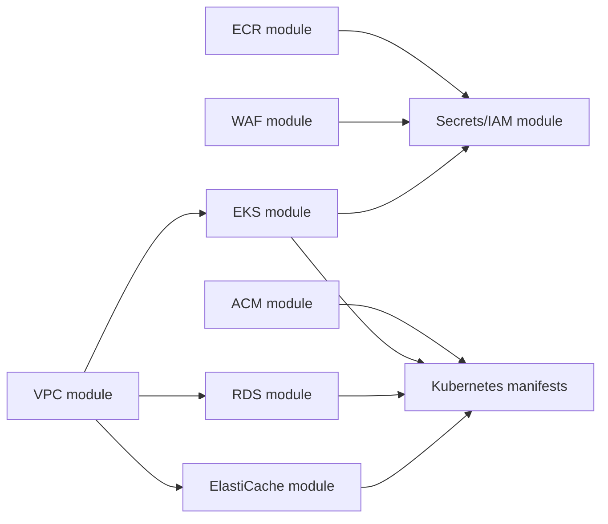

# Terraform

This folder provisions the AWS infrastructure used by the Kubernetes deployment.
It composes the local modules under `terraform/modules/` and stores remote state
in the S3 backend configured in `backend.tf`.

## Stack Overview



## What It Creates

- A VPC with public and private subnets, an internet gateway, and a NAT gateway.
- An EKS cluster, managed node group, core add-ons, AWS Load Balancer Controller,
  External Secrets Operator, and EFS support for shared reports.
- Aurora PostgreSQL Serverless v2 for service-owned tables.
- ElastiCache Redis for shared runtime state such as trading mode.
- One ECR repository per service image.
- An optional DNS-validated ACM certificate for the public ALB.
- An AWS WAF WebACL that protects the public ALB with an IP allowlist.
- IAM roles and policies for Kubernetes service accounts and External Secrets.
- An AWS Secrets Manager secret named `investments/prod`; Terraform writes
  `POSTGRES_PASSWORD` from `db_password` and any entries from
  `app_secret_values`.

## Main Inputs

Inputs are declared in `variables.tf`. Required values are `allowed_ip_cidrs` and
`db_password`; `app_secret_values`, `redis_auth_token`, `redis_node_type`, and
`aurora_postgresql_engine_version` are optional. Set `app_domain_name` and
`app_route53_zone_id` or `app_route53_zone_name` when you want Terraform to
create the ALB HTTPS certificate. The Aurora engine version defaults to AWS
regional selection to
avoid pinning a version that is not available in the selected region. See
`terraform.tfvars.example` for the expected shape.

## Main Outputs

Outputs in `outputs.tf` expose the EKS endpoint/name/CA data, ECR repository
URLs, RDS endpoint, Redis endpoint, WAF WebACL ARN, IRSA role ARN, EFS ID, and
VPC ID. When enabled, the ACM certificate ARN is also exposed for the ALB
Ingress. Some of these values need to be copied into Kubernetes manifests or CI
secrets before deploying workloads.

## Modules

- `modules/vpc`: network foundation.
- `modules/eks`: Kubernetes cluster, node group, controllers, and EFS.
- `modules/rds`: Aurora PostgreSQL.
- `modules/elasticache`: Redis.
- `modules/ecr`: service image repositories.
- `modules/acm`: ALB HTTPS certificate and DNS validation.
- `modules/waf`: ALB-facing WAF allowlist.
- `modules/secrets`: IAM roles, AWS Secrets Manager permissions, and ALB log bucket.

## Basic Usage

```bash
cp terraform.tfvars.example terraform.tfvars
terraform init
terraform plan -out=tfplan
terraform apply tfplan
```

Do not commit `terraform.tfvars`, `tfplan`, `.terraform/`, or state files.

`app_secret_values` can be used for optional secret settings such as broker or
newsletter credentials. Do not include `POSTGRES_PASSWORD` there; it is derived
from `db_password`.

## Kubernetes Version

The stack targets EKS Kubernetes `1.33` by default. AWS supports EKS `1.33`, but
existing EKS clusters can only be upgraded one minor version at a time. If your
live cluster is still `1.30`, upgrade through `1.31`, then `1.32`, then `1.33`
or create a replacement `1.33` cluster and move workloads across.
